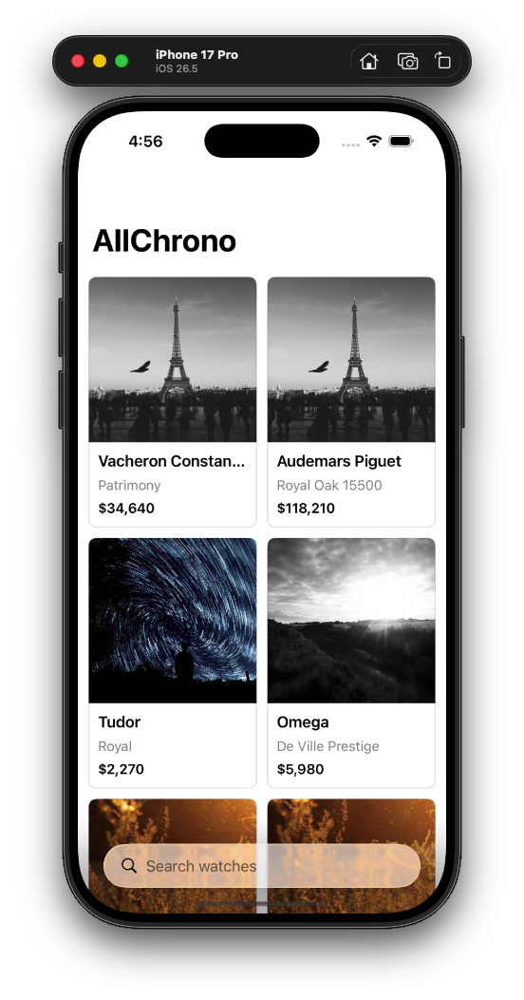
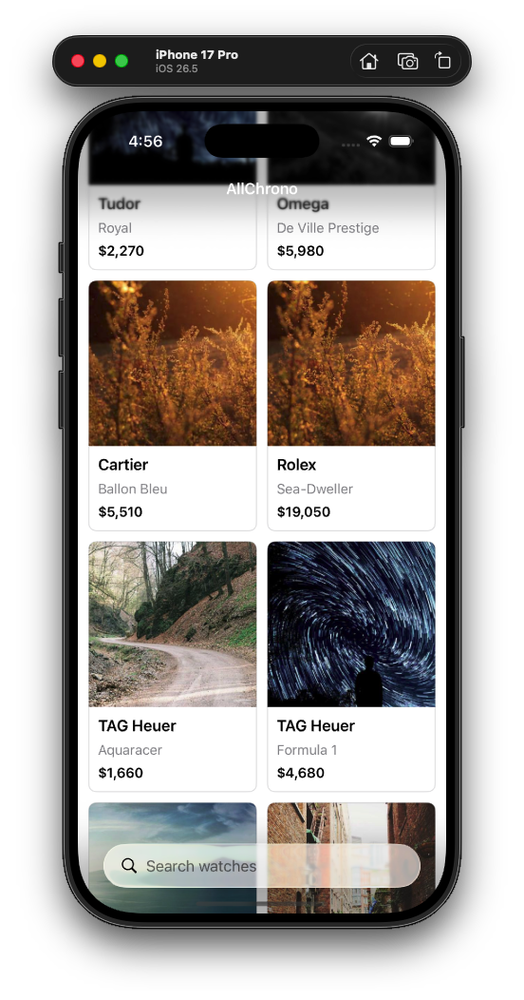
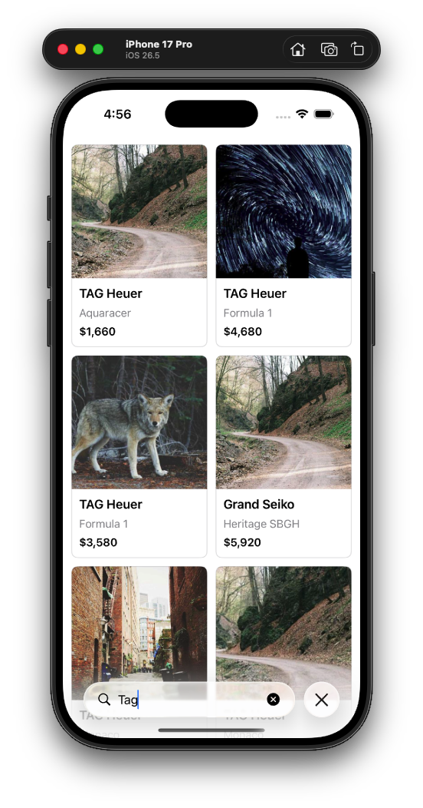

//
//  README.md
//  AllChronoWatchListing_iOS
//
//  Created by Shuvo Joseph on 1/9/26.
//


````markdown
# AllChrono — Watch Listing

A native iOS implementation of the AllChrono watch marketplace listing exercise, built with **SwiftUI**, **Swift Concurrency**, **MVVM**, and the **Repository pattern**.

The goal was to build a clean, production-minded watch listing experience within the provided timebox, while paying particular attention to real-world UI states and image rendering behavior.

---

## 📱 Screenshots

<table>
<tr>
<td align="center">

</td>
<td align="center">

</td>
<td align="center">

</td>
</tr>
</table>

---

## ✨ Features

- Native **SwiftUI** watch listing
- Two-column `LazyVGrid`
- Watch image, make, model, and formatted price
- Remote image loading using `AsyncImage`
- Loading placeholder for images
- Broken-image/error placeholder
- Client-side search using `.searchable`
- Search by both **make** and **model**
- Case-insensitive search
- Empty search-result state
- Loading and general error states
- Offline connectivity indication
- Currency-aware price formatting
- Responsive grid layout for different image aspect ratios

---

## 🏗 Architecture

The project follows a lightweight **MVVM + Repository** architecture.

```text
                    SwiftUI Views
                         │
                         ▼
               WatchListViewModel
                         │
                         ▼
                 WatchRepository
                         │
                         ▼
             LocalWatchRepository
                         │
                         ▼
                    watches.json
````

### SwiftUI

SwiftUI is used for the presentation layer, including the watch grid, search interface, loading states, error states, and image placeholders.

### MVVM

The `WatchListViewModel` owns the presentation state and coordinates loading and client-side filtering.

This keeps the view focused primarily on rendering UI rather than containing data-loading or filtering logic.

### Repository Pattern

The data source is abstracted behind `WatchRepository`.

The current implementation uses `LocalWatchRepository` to load the supplied `watches.json` file from the application bundle.

This keeps the ViewModel independent of where the data comes from and makes it straightforward to replace the local implementation with a real API-backed repository in the future.

### Dependency Injection

The repository and network monitor are injected into the ViewModel rather than being created directly inside it.

This keeps dependencies explicit and makes the architecture easier to test and extend.

### Swift Concurrency

`async/await` is used for the asynchronous watch-loading flow, keeping the implementation modern and avoiding unnecessary callback-based code.

---

## 🔄 Data Flow

```text
watches.json
     │
     ▼
LocalWatchRepository
     │
     │ async/await
     ▼
WatchListViewModel
     │
     ├── Loading state
     ├── Loaded state
     ├── Error state
     └── Client-side search/filtering
     │
     ▼
WatchListView
     │
     ▼
WatchCardView
```

The supplied dataset contains approximately 1,000 watches, so client-side filtering is appropriate for the scope of this exercise.

---

## 🔍 Search

The listing uses SwiftUI's `.searchable` modifier.

Search is performed locally against:

* Watch make
* Watch model

The search is case-insensitive and updates the displayed results immediately.

For example:

```text
"Rolex"
"rolex"
"Submariner"
```

can all be used to find matching watches.

When no watches match the query, a dedicated empty-result state is displayed.

---

## 🖼 Image Handling

Watch images are loaded from their remote URLs using `AsyncImage`.

The UI handles:

* Loading
* Successful image loading
* Invalid/broken image URLs
* Different image aspect ratios

One of the practical issues encountered during implementation was that the supplied image URLs can return images with different dimensions/aspect ratios.

Some images initially caused the grid layout to behave incorrectly and visually extend beyond their intended card boundaries.

The final implementation uses `GeometryReader` to obtain the actual size available to the grid cell and explicitly constrains the loaded image to that size before clipping it.

This keeps images contained within their individual cards while still allowing them to fill the available image area.

---

## 🌐 Offline Handling

A lightweight network monitor is used to observe connectivity.

When the device becomes offline:

* An offline indication is displayed.
* Already-loaded watches remain visible.
* Initial loading failures are presented as an appropriate error state.

The current implementation intentionally does not attempt to provide persistent offline data because the exercise was timeboxed.

---

## 💰 Price Formatting

Prices are formatted using Foundation's currency formatting APIs based on the currency supplied by the dataset.

For example:

```text
14500 USD → $14,500
```

No hard-coded currency symbol is used in the presentation layer.

---

## 🧪 Testing

Given the limited timebox of the exercise, I prioritized the core user-facing functionality, architecture, data loading, search, remote image handling, and edge-case UI states.

A dedicated unit-test suite was not completed within the submission timebox.

With additional time, I would add unit tests around the ViewModel and Repository, particularly for:

* Successful data loading
* Loading failures
* Search by make
* Search by model
* Case-insensitive search
* Empty search results

The Repository abstraction and dependency injection were intentionally kept in place so these components can be tested independently.

---

## ⏱ Timebox & Trade-offs

The exercise was designed as a roughly **3–4 hour take-home assignment**, so I deliberately prioritized the areas that provide the most value for a production-facing listing screen.

### Prioritized

* Clean SwiftUI implementation
* MVVM separation
* Repository abstraction
* Dependency injection
* Async/await
* Search
* Remote image loading
* Loading/error/empty/offline states
* Correct handling of different image dimensions
* Simple, maintainable UI

### Intentionally kept lightweight

* No third-party image-loading framework
* No persistent local database
* No image disk cache
* No pagination
* No complex navigation or additional screens
* No elaborate design system

The intention was to avoid over-engineering a small, self-contained feature while leaving clear extension points for future development.

---

## 🚀 What I Would Build Next

If this were moving toward a production marketplace application, I would consider the following improvements.

### API-backed Repository

Replace the local JSON repository with an API implementation while keeping the `WatchRepository` abstraction unchanged.

```text
WatchRepository
      │
      ├── LocalWatchRepository
      │
      └── RemoteWatchRepository
```

### Pagination

For a production dataset, I would introduce server-side pagination/infinite scrolling rather than loading the complete dataset at once.

### Local Persistence

Use **SwiftData** to persist watch metadata and support a more complete offline experience.

### Image Caching

For a production marketplace with many remote images, I would introduce disk/memory image caching, potentially using a mature image-loading solution such as Kingfisher.

### Retry & Recovery

Add explicit retry behavior for failed requests and image loading, including better handling of transient network failures.

### Testing

Expand unit testing around ViewModels and repositories and add UI/integration tests for important user flows.

### Accessibility & Localization

Further improve accessibility labels, Dynamic Type support, VoiceOver behavior, and localization/internationalization.

### Observability

For a production application, add appropriate analytics, logging, crash reporting, and performance monitoring.

---

## 🤖 AI Usage

AI tools were used as development assistants during the implementation of this take-home assignment.

**Codex** was used within the development workflow to assist with:

* Initial project structure
* SwiftUI implementation
* Repository and ViewModel scaffolding
* JSON model/data-loading implementation
* Search implementation
* Edge-case UI states
* Debugging and iteration

AI assistance was treated as a development tool rather than as a replacement for engineering decisions.

I reviewed the generated changes, ran the application, identified and corrected UI behavior, and made the final implementation decisions.

One example was the remote-image/grid issue: different source image dimensions caused some images to visually exceed their intended grid boundaries. The final solution was manually reviewed and adjusted using `GeometryReader` so each image is constrained to the actual size of its grid cell.

---

## 🛠 Build & Run

1. Clone the repository.
2. Open the Xcode project.
3. Select an iOS Simulator or connected iPhone.
4. Build and run the application.

The supplied `watches.json` file is included in the application bundle and is used by the local repository.

No third-party dependencies are required.

---

## 📁 Project Structure

```text
App/
├── AllChronoApp.swift
└── AppContainer.swift

Models/
└── Watch.swift

Repositories/
├── WatchRepository.swift
└── LocalWatchRepository.swift

ViewModels/
└── WatchListViewModel.swift

Views/
├── WatchListView.swift
└── WatchCardView.swift

Utilities/
└── NetworkMonitor.swift

watches.json
```

---

## Final Note

This implementation intentionally focuses on delivering a small feature with a clean foundation rather than attempting to build an entire marketplace.

The architecture provides clear separation between the UI, presentation state, and data access while leaving room for a future API, persistence, caching, pagination, and broader production concerns.
